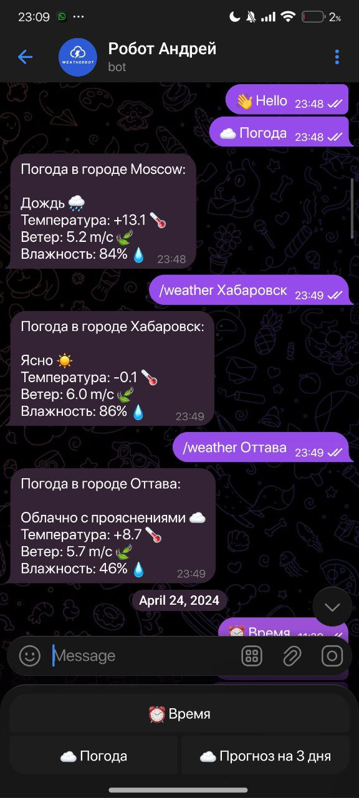
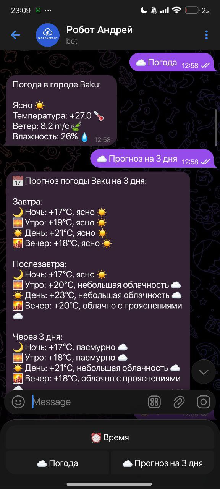

# 🌤️ Telegram Weather Bot

**Проект разработан в рамках курсовой работы на курсах GeekBrains** — телеграм-бот, который предоставляет актуальную информацию о погоде в любом городе мира.

---
## 📸 Примеры работы бота

### Текущая погода

### Прогноз на 3 дня

## ✨ Функциональные возможности

- 📍 **Получение погоды по названию города**  
  Пользователь вводит команду: **`/weather <город>`** — бот выводит текущую погоду.
- 🌥️ **Описание погодных условий с эмодзи**  
  Ясно ☀️, дождь 🌧, снег ❄️, облачно ☁️ и другие состояния.
- 📅 **Прогноз погоды на 3 дня**  
  Отображение погоды по периодам: ночь, утро, день, вечер.
- 💨 **Показ скорости ветра**
- 💧 **Показ уровня влажности**
- 🧭 **Город по умолчанию**  
  Если пользователь не указал город, бот выводит погоду для **Baku**.
- 🔄 **Работа с кнопками Telegram**  
  В интерфейсе доступны кнопки:  
  ⏰ *Время*  
  ☁️ *Погода*  
  📅 *Прогноз на 3 дня*
- ❗ **Обработка ошибок и некорректного ввода**

---

## 🛠️ Используемые технологии

- **Python 3.x** — основной язык разработки.
- **Pyrogram** — библиотека для работы с Telegram Bot API.
- **PyOWM** — обёртка для работы с сервисом OpenWeatherMap.
- **OpenWeatherMap API** — источник всех погодных данных.
- **pytz** — библиотека для работы с часовыми поясами и временем.
